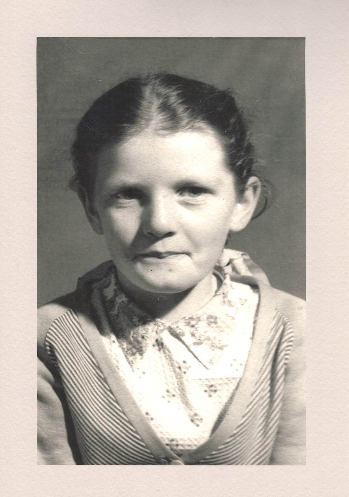
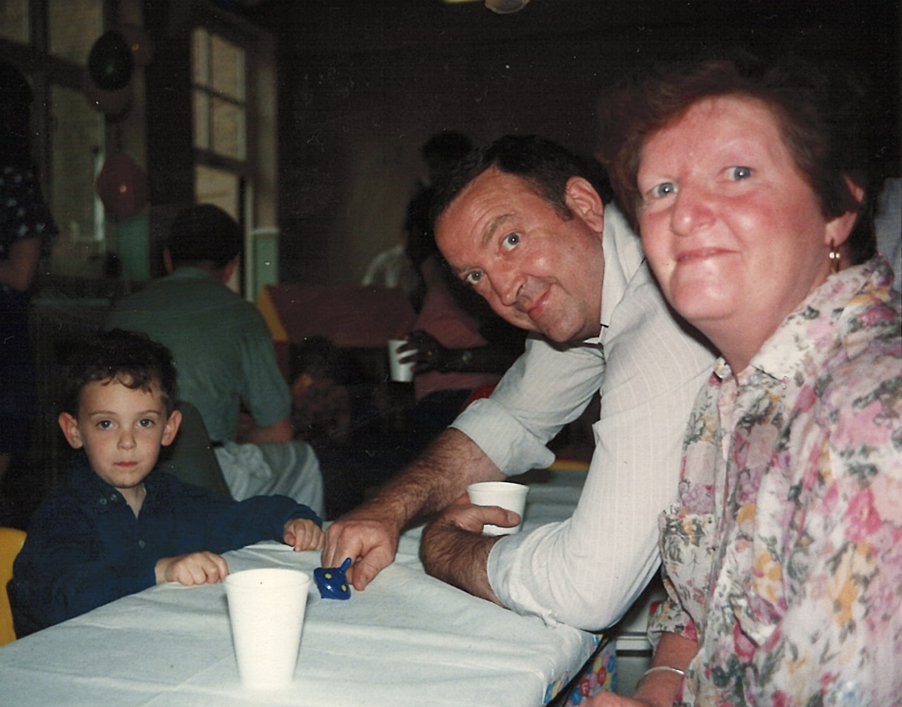
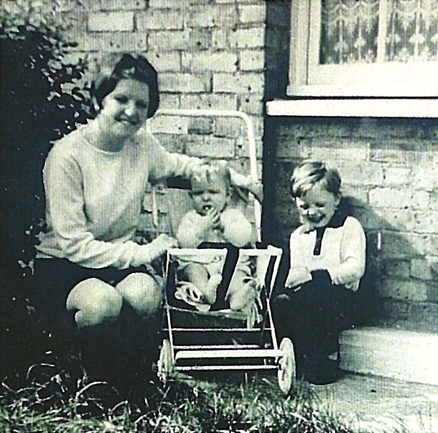
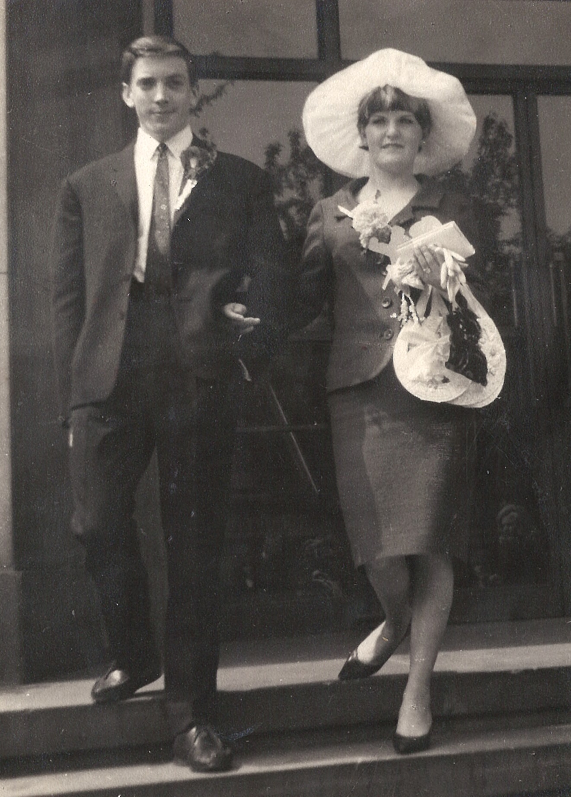

{fig-alt="Photo of me as a child, my Nan and my Grandad sitting at a table." width=50%}

Since being a teenager, spending time with my Nan and Grandad would always end the same way. As I gave my Nan a hug and a kiss goodbye, she would press £20 into my hand and tell me to treat myself to something nice. Just from thinking about it, I can viscerally feel her hand pushing the note into mine and closing it into a fist so I wouldn’t try to give it back or lose it.

In 2023, my Nan, Carol Frances Richardson (née Hart) died at 78, following a recurring cancer. I have probably thought about her in some way every day since then, even as my life has continued to grow around her absence.

Nan never wanted a fuss made over her. Even during radiotherapy and after surgery to remove the tumour, she would spend more time asking other people about how they were doing than talk or complain about her own health. I want to make a fuss over her now.  So I’m writing this to both cherish and share the memories I have of her and to reflect on what she has left me. In some way, this is easy, as Nan was one of those people whose voice, face and mannerisms crystallised readily in my mind. Recalling her vivid nature is easy even if it is sad.

### A natural grandparent

Some of the earliest memories I have are of Nan looking after me before I was old enough to go to school. Sometimes this would be for walks in the park to feed the ducks, followed by watching Thomas the Tank Engine on VHS with cheese and pickle sandwiches and salt and vinegar crisps. Wherever we went, Nan would make sure to pass by places that I liked. There were favourite walls to walk on, a homemade weather station to watch on someone’s balcony, and the fire station in Greenwich, with the big shiny engines at the bottom of the hill. Nan would take me on carefree tours of these kinds of landmarks so cherished by a 3 year old.

Quite often, Nan looked after me at my Grandad’s workshop, where he worked as an upholsterer. She would come up with fake jobs for me or play games with me in the yard outside. Sometimes I would take her place as the chef to do some cooking with the implements they had sitting in a rickety, makeshift kitchen at the back of the shop. Nan would pass me ingredients - ketchup, brown sauce, mustard, vinegar, pepper - that I would mix together to make ‘soups’. She would then encourage my Grandad, Dad or uncle to taste and appreciate them in front of me to my great amusement.

{fig-alt="Photo of me as a child, my Nan and my Grandad sitting at a table." width=50%}

By the time I was in school, Nan and Grandad had moved down to Swalecliffe, on the Kent coast. Me and my brother went down to stay for weekends in their bungalow and, quite frankly, get spoilt. 

Walks or bike rides on the seafront would often be accompanied by trips to the arcade, where Nan would produce bags of change sorted into denominations. Sometimes there would be whelks, cockles and winkles or ice lollies. Outings would be followed by early dinners of shepherds pie, sausages, or a roast. Nan almost always overcooked veg, but her roast potatoes were legendary - the perfect mix of crispy shell and fluffy interior. In my twenties, going down to visit them on a Sunday usually meant coming home uncomfortably full, having eaten three or four too many.

In the evenings, Nan would run us baths with absurd amounts of bubble bath, which were always followed by talcum powder. I had no idea what that was for as a kid, but it was fun. 

Afterwards, we would watch films rented from the local video shop. Later Nan would serve pudding of ice cream or Angel Delight while Nan and Grandad watched Countdown and soaps. Nan would only ever have one eye on the telly - she was always doing doing a colouring book or playing a game with us at the same time before we went to bed.

When it was cold, Nan put us to bed with our socks on. There was no point arguing.

Probably the most enduring memory I have of her is the way she would stand at front door waving until we were completely out of sight whenever we left from a visit. She never stopped doing that for as long as she could get up out of her chair.

### Just a little something

Nan would spoil us at almost any opportunity. Birthdays and Christmas usually involved her and my Grandad arriving with sacks of presents. Usually there was one big gift, packed in with other toys, pens, drawing pads, and weird cuddly toys that were hand-knitted by a woman she had met in her local pub. When I was an adult the toys turned into essentials: gloves, a hat, chocolate coins and a box of Wine Gums.

Presents from Nan had every wrapping seam taped, prolonging the unwrapping experience. Her cards were always signed from her and my grandad, with an extra message from their cats, including feline self portraits.

It was almost impossible to come away from seeing Nan on any occasion without pies or a loaf of bread pudding or (before I turned vegetarian) half a dozen sausage rolls. These were made by her on a semi-industrial scale for her kids, grandkids and friends alike, with Grandad often employed in the factory. Once I had my own children, the bags of food, which were always tied with the tightest knots known to man, were accompanied by little gifts for them too.

When they lived in their bungalow, there was a garden which Nan tended that had my Grandad’s workshop at the end. In the middle was a metal pole, stuck in the ground with a metal plate on the top. After a meal, Nan would put any scraps up there for the birds. It was really gross, but she didn’t want to let the birds go hungry.

My most bittersweet memory of Nan is visiting her a few months before she died. It was August, but nonetheless she handed me an envelope full of cash. It had a note to my children written on the front and she told me it was for their Christmas in case she didn’t make it. Four months in advance, facing the end of her life, she was making sure her great grandchildren got spoiled whatever happened to her. 

When she handed me that envelope and explained, I started winding her up. She was notorious for sending Christmas cards as early as November, not willing to risk the slightest chance of a Royal Mail delay. I teased her that she was going too far this time. But, in the end she never made it to December. The kids got their last Christmas present from her, and I got an envelope scrap that’s too precious to throw away.

As well as the envelope, letters and cards I have from her, I also have a precious string of SMS messages. Dad bought Nan and Grandad a Nokia phone maybe a decade ago. It took some years just to persuade them that it was ok to take the phone off charge and out of the house. Well into the smartphone revolution, Dad taught Nan how to text. Between visits and phone calls, we would exchange messages, filled with her characteristic cheeky sense of humour. One of them from a bus where she told me she was trying to ditch my Grandad. Another mentioning they were stopping off for a pint in the local pub after a spot of shoplifting.

### Another generation

Everything I’ve written so far has been a recollection of experiences of the relationship I had with my Nan and her character as a grandparent. Occasionally, she would tell me little snippets about her own life. Some of them blew my childhood mind.

She had thirteen brothers and sisters, something I still struggle to completely wrap my head around. They grew up in Charlton, sleeping head to toe in just a few rooms. She loved school dinners. They were the only proper meal of the day she would get and the dinner ladies would give her and her siblings a bit extra. She really started with nothing, but always spoke affectionately of her parents, brothers and sisters.

When I was older, Nan confided in me a deeply held secret of how her and one of her sisters would distract the milkman at the front door, while her brothers snuck out the back gate to pinch a few extra bottles out of his crate. She swore me to secrecy on that. I’m not sure if she was just too ashamed for anyone else to know or if she thought the Met still had an open case on the matter.

Nan met my Grandad when they were teenagers. She gave birth to my dad when she was 18, and my uncle just a few years later. I always knew she had given birth to a baby girl before my dad. Later she told me the whole story. Born with health issues, the baby was taken away from my Nan almost immediately after birth and died a few days later. Only Grandad saw her for any amount of time before she passed away. By the time they were told what had happened, the baby had been buried and it was months before my Nan was able to find out where.

{fig-alt="Black and white photo of Nan and two little boys, my dad and my uncle, who is in a buggy." width=50%}

The Nan I knew was warm and endlessly patient, but she could also be fierce and uncompromising. When she was a young mother, my Grandad would come home drunk and late from the pub after work. As punishment, Nan would lock the front door before he came back, sometimes after throwing his dinner in the bin outside their flat. There are other stories of her defending her children from dangerous dogs and giving people a piece of her mind.

One of my biggest regrets today is not collecting more stories directly from my Nan about herself and her life.

### An imprint

Nan was never someone to try to impress her wisdom on you or offer unsolicited advice, yet I still learned from a great deal from her about how to live.

One of her great virtues was to enjoy a life filled with an excess of simplicity. She was grateful for a life filled with good meals, a modest place to live, seeing her family flourish, walks around the park, days out on the British coast and the occasional coach holiday. She appreciated sophisticated things when she had them, but didn’t spend her time worrying about them or pursuing them. 

The flip side of this would sometimes frustrate me. I couldn’t understand, for example, why she (or Grandad) never seemed more interested in exploring other interests or new experiences. My dad and uncle often offered to take them to France, Belgium and Italy for a holiday. They had visited Spain as a young family and would would have loved doing something similar once they went, but appeared indifferent to the idea.

Having come from very humble beginnings, I suspect that Nan already felt like she had a life full of blessings and luxury. For me now, it’s more important to reflect on her outlook as a useful reminder to temper my own desires for things which won’t really bring more fulfilment into my life. She helps me to find gratefulness for what I already have and stay focused on things that bring joy, expand the mind or have some purpose.

The other example that Nan left to me is the ability she had to be present for children. She would enter the worlds of play and imagination that my brother and I set up and go along with whatever games and ideas we had created. To us it seemed like she was as part of it as we were. She never questioned or tried to tweak our games to more grown up, rational notions. She had no qualms about being silly if it meant putting a smile on our faces. 

Now having the role of entertaining my own young children, I realise she was often multi-tasking while she played with us, but it never seemed like it at the time. Sometimes, in moments where I find myself and the kids playing with the same happy abandon she showed me, I can’t help but smile a little more.

### Ever present

No one’s memory needs to be romanticised. What I have written here is mostly about Nan as a grandparent, but she was as complex as any of us. She was full of love and warmth, but sometimes took a disliking to people for what seemed like trivial reasons. She held political views that I disagreed with, but was deeply generous to those she knew and people she met. She had a traditional marriage but had no qualms about putting my Grandad’s feet to the fire. During her final months, I saw her both angry at her own fate, frustrated at her condition, but full of laughter with her family and gratitude for her life.

There is more I could write, but this is long enough for now. Nan was a person with many facets, but I wanted to write about who she was to me. And if that wasn’t already apparent, to me she was the best Nan a nan could be.

{fig-alt="Black and white photo of Nan and Grandad walking down the steps outside." width=50%}